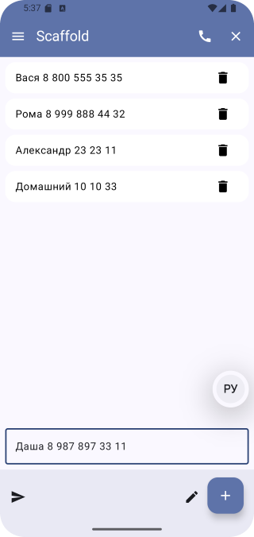
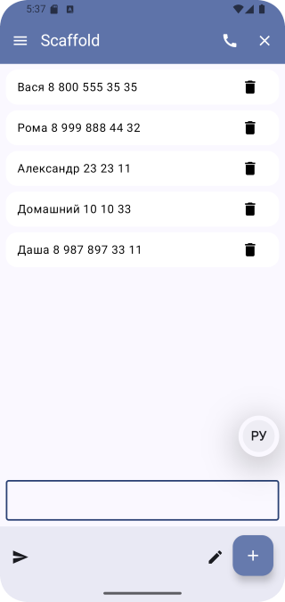
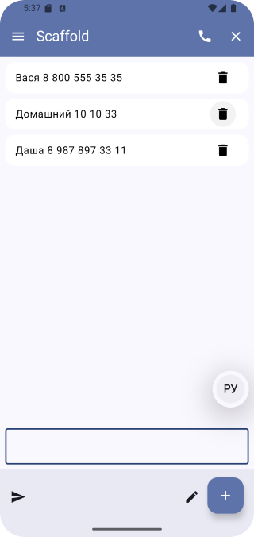
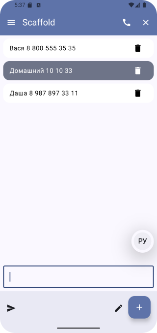
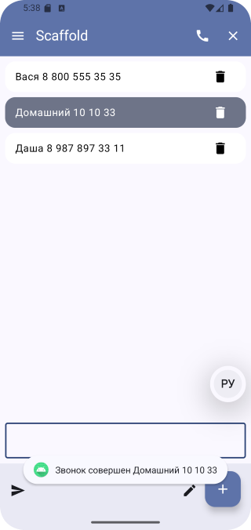
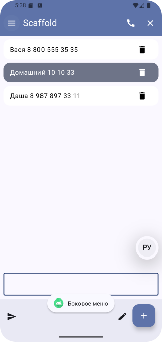
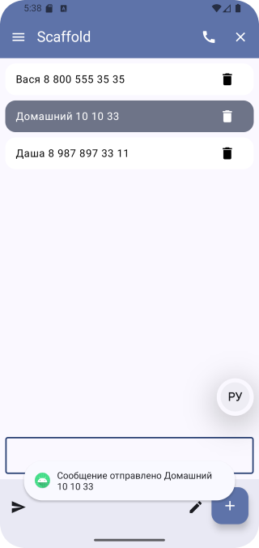
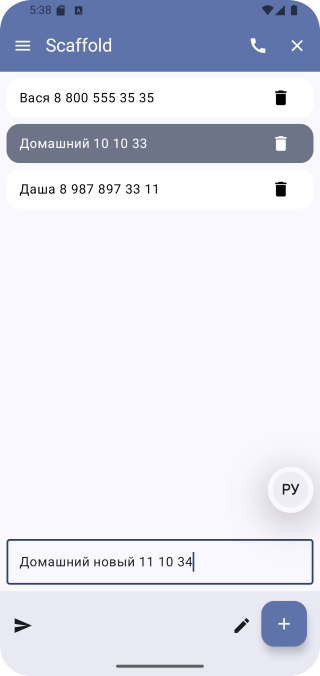
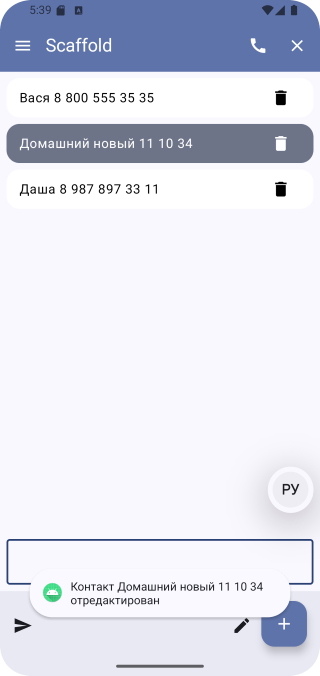

# Домашнее задание по теме "Scaffold"

## Приложение «Телефонная книга»

На основе пройденного материала необходимо написать приложение для вывода прокручиваемого динамического списка с возможностью добавлять и удалять элементы. Добавление элементов производится при помощи ввода текста в `OutlineTextField` по нажатию на `FloatingActionButton`.

Удаление элементов производится по нажатию на `Icon` «Delete» item’а в списке.

Рекомпозиция компонентов должна происходить моментально.

В приложении используются панели приложений.

В `TopAppBar` находятся:

`Icon` «Menu»;

`Icon` «Call»;

`Icon` «Close».

При нажатии на `Icon` «Call» выводится всплывающее сообщение «Звонок совершен (указывается Item)»

При нажатии на `Icon` «Close» приложение закрывается.

В `BottomAppBar` находятся:

`Icon` «Send»;

`Icon` «Edit».

При нажатии на `Icon` «Send» выводится всплывающее сообщение «Сообщение отправлено (указывается Item)»

При нажатии на `Icon` «Edit» выводится всплывающее сообщение «Контакт отредактирован (указывается Item)»

Чтобы при работе всплывающих сообщений в Item указывался конкретный пользователь, необходимо его кликнуть перед нажатием на соответствующую иконку.

## Скриншоты 

 Скриншоты здесь 

